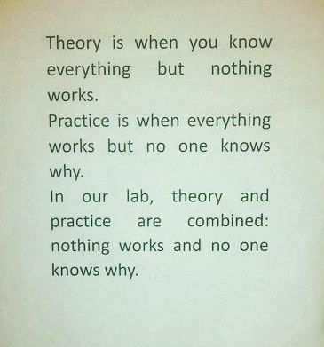
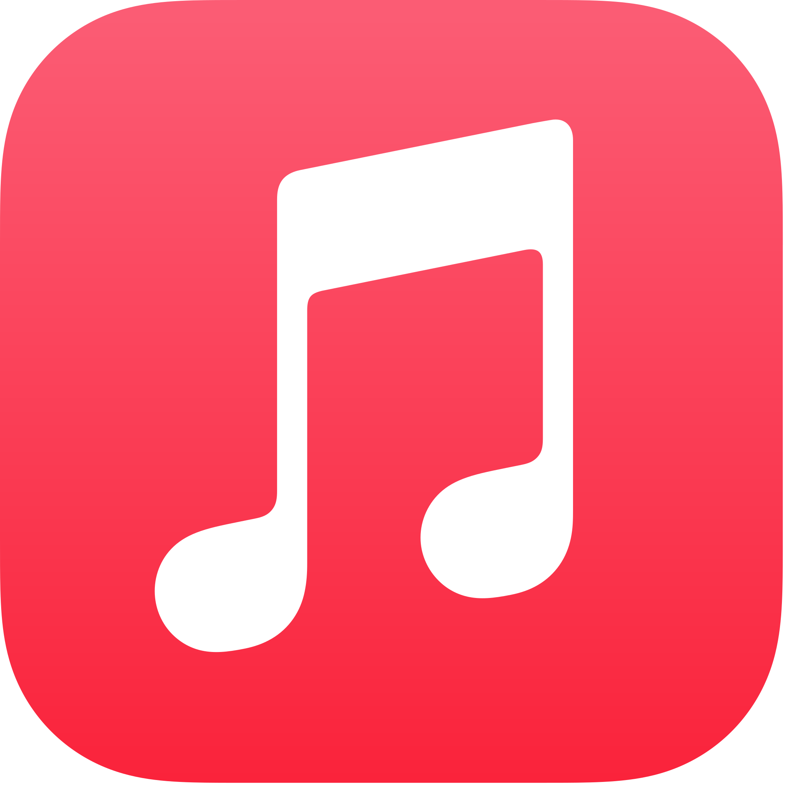
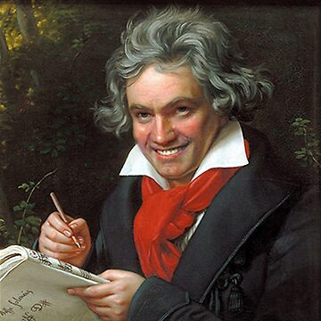

<table>
  <tr>
    <td></td>
    <td align="center">
      <h1>
        

          Hello world!
          
        

      </h1>
      <h2>
        
 My name is Jens W. Langenberg 

      </h2>
      <h3>
        
 I am a 

      </h3>
        

          
        

      

      &nbsp;&nbsp;&nbsp;&nbsp;
      &nbsp;&nbsp;&nbsp;&nbsp;
      &nbsp;&nbsp;&nbsp;&nbsp;
      &nbsp;&nbsp;&nbsp;&nbsp;
      

    </td>
    <td></td>
  </tr>
</table>

## About Me

- 🎧 C++ Audio Developer - passionate about DSP, JUCE, plugins, and tooling  
- 🎼 Classical composer & 3D audio post-production enthusiast  
- 🧪 I love building: samplers, audio effects, UI tools, and game-style systems  
- ♟️ Also created a full chess engine because… why not?  
- 🌍 Always learning, always creating — whether in code or music

## Featured Projects
- 🎻 **[The Orchestra](https://github.com/Diversiam90815/TheOrchestra)**  
  A learning tool for orchestral instruments including a small sampler with piano roll editing.

- ♟️ **[Chess Game Windows](https://github.com/Diversiam90815/Chess-Windows)**  
  C# & WinUi3 chess application.

- ♟️ **[Chess Engine](https://github.com/Diversiam90815/Chess-Engine)**   
  C++ chess engine, including a LAN multiplayer.

- 🔗 **[NetLink](https://github.com/Diversiam90815/NetLink)**   
  C++ networking library handling connection management and communication layer for multiplayer applications.

- 🗂️ **[Logger](https://github.com/Diversiam90815/Logger)**  
  Cross-platform C++ logging wrapper around SPD-Log.

## Languages and Tools

### 🧠 Core Languages  
C++, C#, Python, TypeScript

### 🎛 Audio Development  
JUCE · DSP Algorithms · VST3 Plugin Development · Real-Time Audio ·  
Nuendo · Dorico · Pro Tools · 3D Audio / Spatial Mixing

### 🖥 Desktop & UI  
WinUI 3 · .NET · Win32 · Qt

### 🌐 Networking  
OSC · UDP/TCP Socket Programming

### 🛠 Build & Dependencies  
CMake · Conan · nuget · MSBuild · MSIX Packaging

### 🧪 Testing & Quality  
GoogleTest · Sentry · Logging Systems

### 🔧 DevOps & Tooling  
Git · GitLab CI · Automation scripts

### 🔧 Agile & Scrum Tools  
Jira · Confluence · Slack · Microsoft Teams · Trello · Miro

### 💻 Platforms  
Windows (primary), cross-platform C++ development
